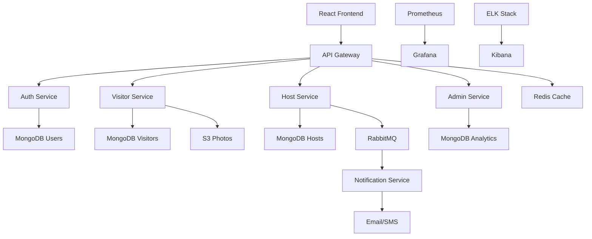
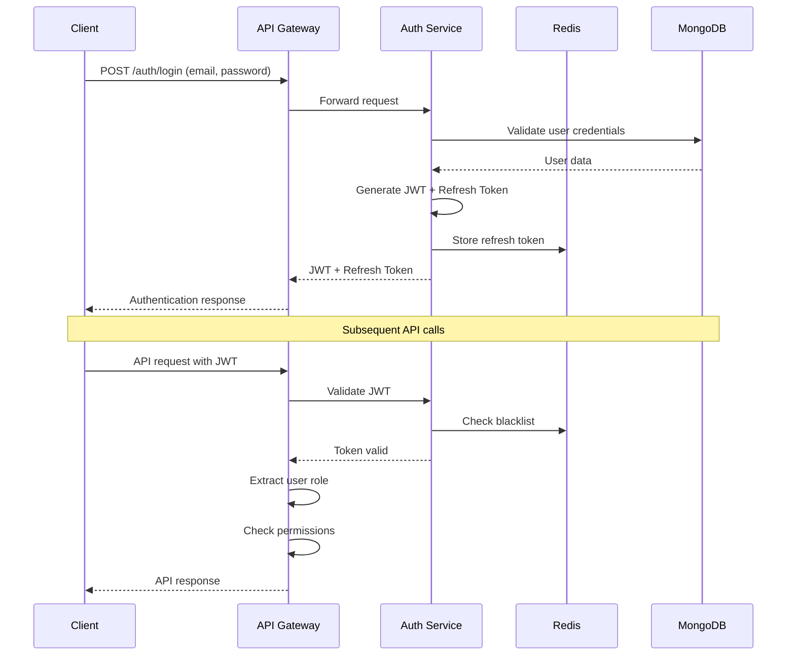

# SecureVMS - Architecture Documentation

## System Architecture Overview

SecureVMS follows a microservices architecture pattern with MongoDB as the primary datastore. The system is designed for scalability, security, and operational excellence in enterprise environments.

## Core Architecture Principles

### 1. Microservices Design
Each service has a single responsibility and can be deployed independently:

- **Auth Service**: Authentication, authorization, JWT management
- **Visitor Service**: Visitor CRUD operations, photo management
- **Host Service**: Host management, notification preferences
- **Notification Service**: Email/SMS notifications via RabbitMQ
- **Admin Service**: Analytics, reporting, system management

### 2. Data-Driven Design
MongoDB's flexible schema supports:
- Embedded documents for visitor check-ins
- Complex queries with aggregation pipelines
- Horizontal scaling with sharding
- TTL indexes for automatic data expiry

### 3. Security-First Approach
- JWT-based authentication with role-based access control
- Photo storage with signed URLs
- Audit logging for compliance
- Input validation and sanitization

## Service Architecture



## Data Architecture

### MongoDB Collections Design

#### 1. Visitors Collection
```javascript
// Optimized for read/write patterns
{
  _id: ObjectId("..."),
  name: "John Doe",
  email: "john@company.com",
  phone: "+1-555-0123",
  company: "TechCorp Inc.",
  photoUrl: "https://s3.../photo.jpg",
  
  // Embedded array for performance
  checkIns: [{
    _id: ObjectId("..."),
    hostId: ObjectId("..."),
    hostName: "Jane Manager",
    status: "approved", // pending, approved, denied, checked-out
    checkInTime: ISODate("2024-01-15T09:00:00Z"),
    checkOutTime: ISODate("2024-01-15T17:30:00Z"),
    purpose: "Weekly team meeting",
    badgeNumber: "VMS001",
    qrCode: "QR_VMS001_20240115"
  }],
  
  createdAt: ISODate("2024-01-15T09:00:00Z"),
  updatedAt: ISODate("2024-01-15T17:30:00Z")
}
```

**Indexes:**
```javascript
// Compound indexes for common queries
db.visitors.createIndex({ "email": 1, "createdAt": -1 })
db.visitors.createIndex({ "company": 1, "createdAt": -1 })
db.visitors.createIndex({ "checkIns.status": 1, "checkIns.checkInTime": -1 })
db.visitors.createIndex({ "checkIns.hostId": 1, "checkIns.status": 1 })

// Text search for visitor lookup
db.visitors.createIndex({ 
  "name": "text", 
  "email": "text", 
  "company": "text" 
})
```

#### 2. PreApprovals Collection
```javascript
{
  _id: ObjectId("..."),
  visitorName: "Bob Smith",
  visitorEmail: "bob@consulting.com",
  visitorPhone: "+1-555-0456",
  visitorCompany: "Smith Consulting",
  
  hostId: ObjectId("..."),
  hostName: "Jane Manager",
  
  scheduledDate: ISODate("2024-01-16T14:00:00Z"),
  purpose: "Technical consultation",
  
  status: "active", // active, used, expired
  
  // TTL for automatic cleanup
  expiresAt: ISODate("2024-01-17T14:00:00Z"),
  createdAt: ISODate("2024-01-15T10:00:00Z")
}
```

**TTL Index:**
```javascript
// Automatically delete expired pre-approvals
db.preapprovals.createIndex({ "expiresAt": 1 }, { expireAfterSeconds: 0 })
```

#### 3. Users Collection
```javascript
{
  _id: ObjectId("..."),
  name: "Jane Manager",
  email: "jane@company.com",
  passwordHash: "$2b$12$...", // bcrypt hash
  
  role: "host", // security, host, admin
  department: "Engineering",
  
  // Role-specific data
  permissions: ["visitor:approve", "visitor:view"],
  notificationPreferences: {
    email: true,
    sms: false,
    inApp: true
  },
  
  isActive: true,
  lastLogin: ISODate("2024-01-15T08:30:00Z"),
  createdAt: ISODate("2024-01-01T00:00:00Z")
}
```

### Aggregation Pipelines

#### Daily Visitor Statistics
```javascript
db.visitors.aggregate([
  {
    $match: {
      createdAt: {
        $gte: new Date("2024-01-15T00:00:00Z"),
        $lt: new Date("2024-01-16T00:00:00Z")
      }
    }
  },
  {
    $unwind: "$checkIns"
  },
  {
    $group: {
      _id: "$checkIns.status",
      count: { $sum: 1 },
      avgDuration: {
        $avg: {
          $subtract: ["$checkIns.checkOutTime", "$checkIns.checkInTime"]
        }
      }
    }
  },
  {
    $project: {
      status: "$_id",
      count: 1,
      avgDurationHours: {
        $divide: ["$avgDuration", 1000 * 60 * 60]
      }
    }
  }
])
```

#### Top Visiting Companies
```javascript
db.visitors.aggregate([
  {
    $match: {
      createdAt: { $gte: new Date(Date.now() - 30 * 24 * 60 * 60 * 1000) }
    }
  },
  {
    $group: {
      _id: "$company",
      totalVisits: { $sum: 1 },
      uniqueVisitors: { $addToSet: "$email" },
      lastVisit: { $max: "$createdAt" }
    }
  },
  {
    $project: {
      company: "$_id",
      totalVisits: 1,
      uniqueVisitorCount: { $size: "$uniqueVisitors" },
      lastVisit: 1
    }
  },
  {
    $sort: { totalVisits: -1 }
  },
  {
    $limit: 10
  }
])
```

## API Design

### RESTful Endpoints

#### Visitor Service
```
GET    /api/visitors                    # List visitors (paginated)
POST   /api/visitors                    # Create new visitor check-in
GET    /api/visitors/:id                # Get visitor details
PUT    /api/visitors/:id/checkins/:cid  # Update check-in status
DELETE /api/visitors/:id                # Soft delete visitor (GDPR)

GET    /api/visitors/active             # Currently active visitors
GET    /api/visitors/pending            # Pending approval
GET    /api/visitors/stats              # Visitor statistics
```

#### Pre-approval Service
```
GET    /api/preapprovals               # List pre-approvals
POST   /api/preapprovals               # Create pre-approval
GET    /api/preapprovals/:id           # Get pre-approval details
PUT    /api/preapprovals/:id           # Update pre-approval
DELETE /api/preapprovals/:id           # Cancel pre-approval

POST   /api/preapprovals/:id/use       # Mark as used during check-in
```

#### Authentication Service
```
POST   /api/auth/login                 # User login
POST   /api/auth/refresh               # Refresh JWT token
POST   /api/auth/logout                # Logout (invalidate token)
GET    /api/auth/me                    # Get current user info
PUT    /api/auth/me                    # Update user profile
```

### GraphQL Alternative (Future Enhancement)
```graphql
type Visitor {
  id: ID!
  name: String!
  email: String!
  company: String!
  photoUrl: String
  checkIns: [CheckIn!]!
  createdAt: DateTime!
}

type CheckIn {
  id: ID!
  host: User!
  status: CheckInStatus!
  checkInTime: DateTime!
  checkOutTime: DateTime
  purpose: String!
  badgeNumber: String
}

type Query {
  visitors(filter: VisitorFilter, pagination: Pagination): VisitorConnection!
  activeVisitors: [Visitor!]!
  visitorStats(dateRange: DateRange): VisitorStats!
}

type Mutation {
  createVisitorCheckIn(input: CheckInInput!): CheckIn!
  approveVisitor(checkInId: ID!): CheckIn!
  checkOutVisitor(checkInId: ID!): CheckIn!
}
```

## Caching Strategy

### Redis Cache Patterns

#### 1. Session Storage
```javascript
// JWT token blacklist for logout
const blacklistKey = `blacklist:${tokenJti}`;
await redis.setex(blacklistKey, jwtExpiry, 'true');

// User session data
const sessionKey = `session:${userId}`;
await redis.setex(sessionKey, 3600, JSON.stringify(userData));
```

#### 2. Frequently Accessed Data
```javascript
// Host list for check-in forms
const hostListKey = 'hosts:active';
const cachedHosts = await redis.get(hostListKey);
if (!cachedHosts) {
  const hosts = await User.find({ role: 'host', isActive: true });
  await redis.setex(hostListKey, 300, JSON.stringify(hosts)); // 5 min TTL
}

// Visitor statistics
const statsKey = `stats:daily:${dateKey}`;
const cachedStats = await redis.get(statsKey);
if (!cachedStats) {
  const stats = await calculateDailyStats(date);
  await redis.setex(statsKey, 3600, JSON.stringify(stats)); // 1 hour TTL
}
```

## Message Queue Architecture

### RabbitMQ Event-Driven Communication

#### 1. Exchange and Queue Setup
```javascript
// visitor.events.js
const EXCHANGES = {
  VISITOR_EVENTS: 'visitor.events',
  NOTIFICATION_EVENTS: 'notification.events'
};

const QUEUES = {
  VISITOR_CHECKED_IN: 'visitor.checked_in',
  VISITOR_APPROVED: 'visitor.approved',
  SEND_EMAIL: 'send.email',
  SEND_SMS: 'send.sms'
};

// Create exchanges and queues
await channel.assertExchange(EXCHANGES.VISITOR_EVENTS, 'topic', { durable: true });
await channel.assertQueue(QUEUES.VISITOR_CHECKED_IN, { durable: true });

// Bind queue to exchange
await channel.bindQueue(
  QUEUES.VISITOR_CHECKED_IN, 
  EXCHANGES.VISITOR_EVENTS, 
  'visitor.checked_in.*'
);
```

#### 2. Event Publishing
```javascript
// When visitor checks in
const publishVisitorCheckIn = async (visitor, checkIn) => {
  const event = {
    eventType: 'visitor.checked_in',
    timestamp: new Date().toISOString(),
    data: {
      visitorId: visitor._id,
      visitorName: visitor.name,
      hostId: checkIn.hostId,
      hostName: checkIn.hostName,
      company: visitor.company,
      purpose: checkIn.purpose
    }
  };

  await channel.publish(
    EXCHANGES.VISITOR_EVENTS,
    'visitor.checked_in.pending',
    Buffer.from(JSON.stringify(event)),
    { persistent: true }
  );
};
```

#### 3. Event Consumption
```javascript
// Notification service consumer
const processVisitorCheckIn = async (message) => {
  const event = JSON.parse(message.content.toString());
  
  // Send notification to host
  await sendEmailNotification({
    to: await getHostEmail(event.data.hostId),
    subject: `Visitor Check-in: ${event.data.visitorName}`,
    template: 'visitor-checkin',
    data: event.data
  });
  
  // Send SMS if enabled
  const hostPrefs = await getHostNotificationPreferences(event.data.hostId);
  if (hostPrefs.sms) {
    await sendSMSNotification({
      to: await getHostPhone(event.data.hostId),
      message: `${event.data.visitorName} from ${event.data.company} is here to see you.`
    });
  }
  
  channel.ack(message);
};

channel.consume(QUEUES.VISITOR_CHECKED_IN, processVisitorCheckIn);
```

## Security Architecture

### Authentication Flow


### Role-Based Access Control
```javascript
// permissions.js
const PERMISSIONS = {
  VISITOR_VIEW: 'visitor:view',
  VISITOR_APPROVE: 'visitor:approve',
  VISITOR_MANAGE: 'visitor:manage',
  ADMIN_ANALYTICS: 'admin:analytics',
  ADMIN_USERS: 'admin:users'
};

const ROLE_PERMISSIONS = {
  security: [
    PERMISSIONS.VISITOR_VIEW,
    PERMISSIONS.VISITOR_APPROVE,
    PERMISSIONS.VISITOR_MANAGE
  ],
  host: [
    PERMISSIONS.VISITOR_VIEW,
    PERMISSIONS.VISITOR_APPROVE
  ],
  admin: [
    ...Object.values(PERMISSIONS)
  ]
};

// Middleware for permission checking
const requirePermission = (permission) => {
  return (req, res, next) => {
    const userPermissions = ROLE_PERMISSIONS[req.user.role] || [];
    if (!userPermissions.includes(permission)) {
      return res.status(403).json({ error: 'Insufficient permissions' });
    }
    next();
  };
};

// Usage in routes
router.get('/visitors', 
  authenticateJWT, 
  requirePermission(PERMISSIONS.VISITOR_VIEW), 
  getVisitors
);
```

## Monitoring & Observability

### Prometheus Metrics
```javascript
// metrics.js
const promClient = require('prom-client');

// Custom metrics
const visitorCheckInCounter = new promClient.Counter({
  name: 'visitor_checkins_total',
  help: 'Total number of visitor check-ins',
  labelNames: ['status', 'company', 'host_department']
});

const visitDurationHistogram = new promClient.Histogram({
  name: 'visit_duration_seconds',
  help: 'Duration of visitor stays in seconds',
  labelNames: ['company', 'host_department'],
  buckets: [300, 900, 1800, 3600, 7200, 14400, 28800] // 5min to 8hrs
});

const apiRequestDuration = new promClient.Histogram({
  name: 'http_request_duration_seconds',
  help: 'Duration of HTTP requests in seconds',
  labelNames: ['method', 'route', 'status_code']
});

// Middleware to collect metrics
const metricsMiddleware = (req, res, next) => {
  const start = Date.now();
  
  res.on('finish', () => {
    const duration = (Date.now() - start) / 1000;
    apiRequestDuration
      .labels(req.method, req.route?.path || req.path, res.statusCode)
      .observe(duration);
  });
  
  next();
};
```

### Structured Logging
```javascript
// logger.js
const winston = require('winston');

const logger = winston.createLogger({
  level: process.env.LOG_LEVEL || 'info',
  format: winston.format.combine(
    winston.format.timestamp(),
    winston.format.errors({ stack: true }),
    winston.format.json()
  ),
  defaultMeta: { 
    service: process.env.SERVICE_NAME || 'vms-service',
    version: process.env.APP_VERSION || '1.0.0'
  },
  transports: [
    new winston.transports.Console(),
    new winston.transports.File({ 
      filename: 'logs/error.log', 
      level: 'error' 
    }),
    new winston.transports.File({ 
      filename: 'logs/combined.log' 
    })
  ]
});

// Audit logging for security events
const auditLogger = winston.createLogger({
  format: winston.format.combine(
    winston.format.timestamp(),
    winston.format.json()
  ),
  transports: [
    new winston.transports.File({ 
      filename: 'logs/audit.log',
      maxsize: 10485760, // 10MB
      maxFiles: 10
    })
  ]
});

// Usage
logger.info('Visitor checked in', {
  visitorId: visitor._id,
  visitorName: visitor.name,
  hostId: checkIn.hostId,
  company: visitor.company,
  ipAddress: req.ip,
  userAgent: req.get('User-Agent')
});

auditLogger.info('User login', {
  userId: user._id,
  email: user.email,
  role: user.role,
  ipAddress: req.ip,
  success: true
});
```

## Deployment Architecture

### Kubernetes Deployment
```yaml
# visitor-service-deployment.yaml
apiVersion: apps/v1
kind: Deployment
metadata:
  name: visitor-service
  labels:
    app: visitor-service
spec:
  replicas: 3
  selector:
    matchLabels:
      app: visitor-service
  template:
    metadata:
      labels:
        app: visitor-service
    spec:
      containers:
      - name: visitor-service
        image: securevms/visitor-service:1.0.0
        ports:
        - containerPort: 3001
        env:
        - name: MONGODB_URI
          valueFrom:
            secretKeyRef:
              name: mongodb-secret
              key: connection-string
        - name: REDIS_URL
          valueFrom:
            configMapKeyRef:
              name: redis-config
              key: url
        resources:
          requests:
            memory: "256Mi"
            cpu: "250m"
          limits:
            memory: "512Mi"
            cpu: "500m"
        livenessProbe:
          httpGet:
            path: /health
            port: 3001
          initialDelaySeconds: 30
          periodSeconds: 10
        readinessProbe:
          httpGet:
            path: /ready
            port: 3001
          initialDelaySeconds: 5
          periodSeconds: 5
```

### MongoDB StatefulSet
```yaml
# mongodb-statefulset.yaml
apiVersion: apps/v1
kind: StatefulSet
metadata:
  name: mongodb
spec:
  serviceName: mongodb
  replicas: 3
  selector:
    matchLabels:
      app: mongodb
  template:
    metadata:
      labels:
        app: mongodb
    spec:
      containers:
      - name: mongodb
        image: mongo:6.0
        command:
        - mongod
        - "--replSet"
        - "rs0"
        - "--bind_ip_all"
        ports:
        - containerPort: 27017
        env:
        - name: MONGO_INITDB_ROOT_USERNAME
          valueFrom:
            secretKeyRef:
              name: mongodb-secret
              key: username
        - name: MONGO_INITDB_ROOT_PASSWORD
          valueFrom:
            secretKeyRef:
              name: mongodb-secret
              key: password
        volumeMounts:
        - name: mongodb-storage
          mountPath: /data/db
        resources:
          requests:
            memory: "1Gi"
            cpu: "500m"
          limits:
            memory: "2Gi"
            cpu: "1000m"
  volumeClaimTemplates:
  - metadata:
      name: mongodb-storage
    spec:
      accessModes: ["ReadWriteOnce"]
      storageClassName: "fast-ssd"
      resources:
        requests:
          storage: 100Gi
```

## Performance Optimization

### Database Optimization
1. **Index Strategy**: Compound indexes for common query patterns
2. **Read Replicas**: Separate read replicas for analytics queries
3. **Connection Pooling**: Mongoose connection pooling with proper limits
4. **Query Optimization**: Use aggregation pipelines for complex queries

### Caching Strategy
1. **Application Cache**: Redis for session data and frequently accessed data
2. **CDN**: CloudFront for photo delivery
3. **Database Query Cache**: MongoDB query result caching
4. **API Response Cache**: Cache API responses for read-heavy endpoints

### Horizontal Scaling
1. **Load Balancing**: NGINX or AWS ALB for traffic distribution
2. **Auto Scaling**: Kubernetes HPA based on CPU/memory metrics
3. **Database Sharding**: MongoDB sharding for large datasets
4. **Microservice Scaling**: Independent scaling of each service

This architecture provides a robust, scalable, and secure foundation for the SecureVMS system, supporting enterprise-level visitor management requirements while maintaining operational excellence.